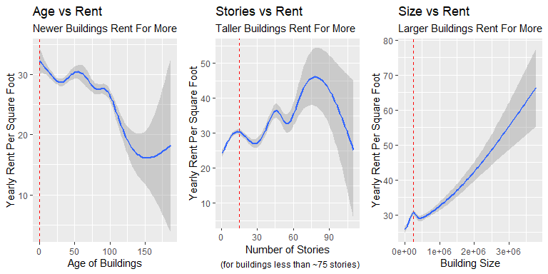
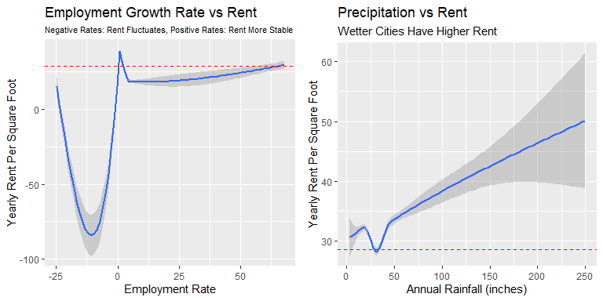
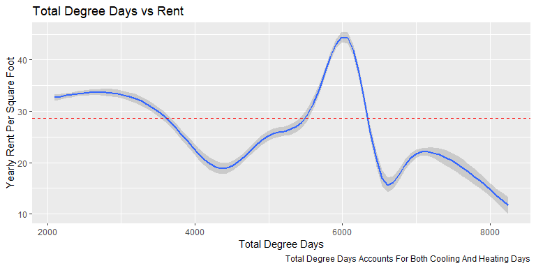
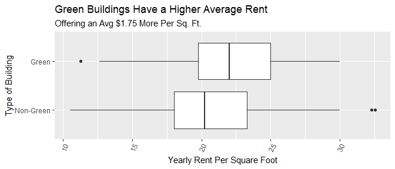
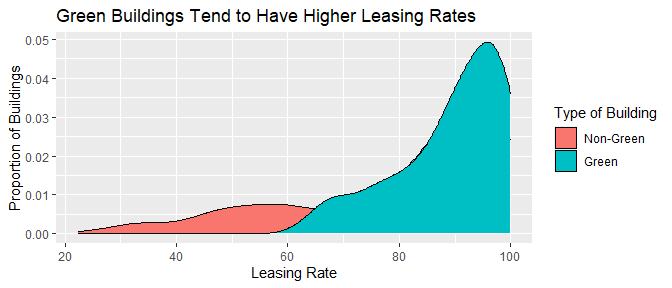
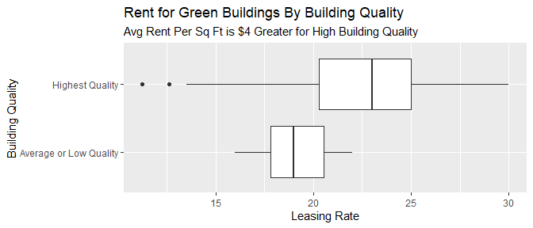
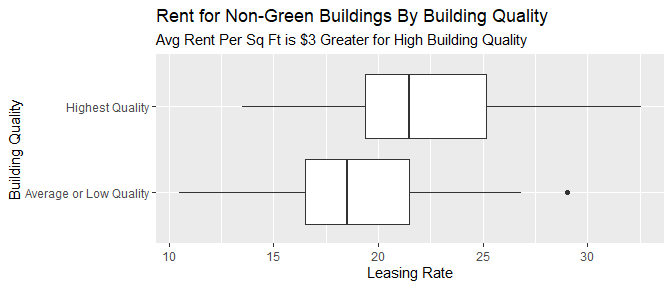

# Is A Green Building Worth It? 

Over the past decade, both investors and the general public have paid
increasingly close attention to the benefits of environmentally
conscious buildings. We want to examine commercial real-estate market 
data to determine if tenants are willing to pay a premium for rental 
space in green buildings.

### The Case

An Austin real-estate developer is interested in the possible economic
impact of “going green” in her latest project: a new 15-story mixed-use
building on East Cesar Chavez, just across I-35 from downtown. Will
investing in a green building be worth it, from an economic perspective?
The baseline construction costs are $100 million, with a 5% expected
premium for green certification.

The developer has had someone on her staff offer a preliminary reccomendation: 

> I began by cleaning the data a little bit. In particular, I noticed
> that a handful of the buildings in the data set had very low occupancy
> rates (less than 10% of available space occupied). I decided to remove
> these buildings from consideration, on the theory that these buildings
> might have something weird going on with them, and could potentially
> distort the analysis. Once I scrubbed these low-occupancy buildings
> from the data set, I looked at the green buildings and non-green
> buildings separately. The median market rent in the non-green
> buildings was $25 per square foot per year, while the median market
> rent in the green buildings was $27.60 per square foot per year: about
> $2.60 more per square foot. (I used the median rather than the mean,
> because there were still some outliers in the data, and the median is
> a lot more robust to outliers.) Because our building would be 250,000
> square feet, this would translate into an additional $250000 x 2.6 =
> $650000 of extra revenue per year if we build the green building.

> Our expected baseline construction costs are $100 million, with a 5%
> expected premium for green certification. Thus we should expect to
> spend an extra $5 million on the green building. Based on the extra
> revenue we would make, we would recuperate these costs in
> $5000000/650000 = 7.7 years. Even if our occupancy rate were only 90%,
> we would still recuperate the costs in a little over 8 years. Thus
> from year 9 onwards, we would be making an extra $650,000 per year in
> profit. Since the building will be earning rents for 30 years or more,
> it seems like a good financial move to build the green building.

### What Data Are We Using? 
The file [greenbuildings.csv](https://github.com/indialindsay/Visual-Storytelling-Green-Buildings/blob/master/greenbuildings.csv) contains data
on 7,894 commercial rental properties from across the United States
constructed by real-estate economists. Of
these, 685 properties have been awarded either LEED or EnergyStar
certification as a green building (find out more about this certification 
at www.usgbc.org).

Each of these 685 buildings was matched to a cluster of nearby commercial 
buildings. Each small cluster contains one green-certified building, and
all non-rated buildings within a quarter-mile radius of the certified
building. On average, each of the 685 clusters contains roughly 12
buildings. 

For each building, we have information on their:  
-   size: the total square footage of available rental space in the
    building.  
-   empl.gr: the year-on-year growth rate in employment in the
    building’s geographic region.  
-   rent: the rent charged to tenants in the building, in dollars per
    square foot per calendar year.  
-   leasing.rate: a measure of occupancy; the fraction of the building’s
    available space currently under lease.  
-   stories: the height of the building in stories.  
-   age: the age of the building in years.  
-   renovated: whether the building has undergone substantial
    renovations during its lifetime.  
-   class: an indicator of building quality; A is highest, B is reasonable, 
    and C is lowest quality.  
-   green.rating: an indicator for whether the building is either LEED-
    or EnergyStar-certified.  
-   LEED, Energystar: indicators for the two specific kinds of green
    certifications.  
-   net: an indicator as to whether the rent is quoted on a “net
    contract” basis. Tenants with net-rental contracts pay their own
    utility costs, which are otherwise included in the quoted rental
    price.  
-   amenities: an indicator of whether at least one of the following
    amenities is available on-site: bank, convenience store, dry
    cleaner, restaurant, retail shops, fitness center.  
-   cd.total.07: number of cooling degree days in the building’s region
    in 2007. A degree day is a measure of demand for energy; higher
    values mean greater demand. Cooling degree days are measured
    relative to a baseline outdoor temperature, below which a building
    needs no cooling.  
-   hd.total07: number of heating degree days in the building’s region
    in 2007. Heating degree days are also measured relative to a
    baseline outdoor temperature, above which a building needs no
    heating.  
-   total.dd.07: the total number of degree days (either heating or
    cooling) in the building’s region in 2007.  
-   Precipitation: annual precipitation in inches in the building’s
    geographic region.
-   Gas.Costs: a measure of how much natural gas costs in the building’s
    geographic region.  
-   Electricity.Costs: a measure of how much electricity costs in the
    building’s geographic region.  
-   cluster.rent: a measure of average rent per square-foot per calendar
    year in the building’s local market.

## Analysis: Revisiting The Recommendation 
============================================

The Austin-based real estate developer is seeking to understand the
financial returns to green certification for her new building.
Construction of the building is priced at $100 million, with an expected
$5 million premium for green certification. An analyst on the
developer’s staff estimated that green certification for the building
will result in an additional $650,000 of yearly revenue and that it will
take 7.7 years to recuperate the premium, considering the building has
an occupancy rate of 100%. The analyst calculated his estimates by
looking at all buildings with leasing rates greater than 10%. The goal
of our analysis is to revisit the analyst’s estimates, using the same
data set containing statistics on 7,894 buildings, and determine if the
presented returns to green certification are accurate.

### Newer, Taller, Larger Buildings Have Higher Rental Rates

The developer’s building is 15 stories tall, 250,000 square feet, and
has an age of 0. To evaluate if the analyst should have accounted for
our building’s physical features, the below plots reveal the general
relationships between Rent and each of these features. The gray shading
around the line represents our margin of error for this estimate and the
vertical red line represents our building.

### Location, Location, and… Location

The building is located on East Cesar Chavez in Austin, Texas. Using
outside sources, we were able to identify the local employment growth
rate (2.5% as of March 31, 2020:
[source](https://www.austinchamber.com/blog/04-21-2020-job-growth-unemployment)),
average annual rainfall (34 inches:
[source](https://www.weather.gov/media/ewx/climate/ClimateSummary-ewx-Austin.pdf)),
and the number of degree days (2,248 heating days, 2,862 cooling days,
and 5,110 total degree days:
[source](https://www.eia.gov/energyexplained/units-and-calculators/degree-days.php)).
The data set measured the values for degree days in 2007 however, as the
2007 estimates were unavailable, we used the 2018 values as they are
likely a close estimate. We were unable to find information on the other
location-based variables present in the data set.

The below plots investigate whether these geographical characteristics
have any affect on a building’s rent. The red dashed line represents the
data set’s mean rent. While the direct relationship between the
following location-based features and rent may not be clear, they help
us understand where the rental market is inflated.

The left plot indicates how rent is only stable for regions with
positive employment growth rates. Otherwise, rent greatly varies for
different levels of employment growth rates. The right plot reveals how
rent spikes for regions with greater precipitation. This graph may be
capturing the high rental rates for cities that receive high rainfall,
such as San Francisco and the Pacific Northwest region.

In the above plot, the big spike that occurs around 6,000 degree days is
likely capturing cities with more extreme temperatures; NYC, Chicago, or
Miami. The high left values with more moderate-climates may represent
the Pacific Northwest region. The dip in the lower right might capture
northern regions with very extreme weather and low property values.

The relationship between rent and regional variables is complicated.
Ultimately, it is best to account for as many physical and regional
features as possible when estimating returns to green certification.

### Taking A Relevant Subset

We obtained a subset of the buildings data set that contained buildings
within +/- 1 standard deviations of our building’s size, stories, age,
regional employment growth rate, regional annual rainfall, and regional
degree days. We dropped buildings that had less than 10% occupancy to
avoid outliers. This data set contained information on 314 buildings, 73
of which were green and 241 of which were non-green.

### What Can We Learn From Buildings With Similar Features?

Looking only at similar buildings, the median rent for a green building
is $22 while the median rent for a non-green building is $20.25.

Green buildings also have a higher median leasing rate of 91.43%
compared with the non-green leasing rate of 88.49%.

### Other Lurking Features Remain

The building’s quality is measured in the data set by standards of high
(class a), average (class b), or low (class c). The below plots reveal
how the quality of the building has a significant association with
higher rent per sq foot for buildings similar to ours. One would expect
green certified buildings to be of higher quality however, these
variables have a fairly low correlation of 0.248.

### Concluding Thoughts

The analyst’s conclusion that a green certification yields a greater
return was accurate however, his analysis was quite faulty. He greatly
overestimated the degree of the return in yearly rent per square foot as
he did not account for the building’s characteristics. The analyst
focused on the number of years it would take to recuperate the initial
premium. As it is almost impossible that every individual square foot of
a building could be rented out, these estimates are irrelevant.

Our analysis concluded that green certification is worth the extra
premium. Green buildings offer an additional $1.75 in yearly rent per
square foot, on average. Based upon higher average occupancy rates, it
is more likely that green buildings will have a higher total level of
income than non-green buildings. However, it is essential that the
developer ensure her building is of high quality as this variable leads
to a greater difference in rent for buildings similar to ours.
